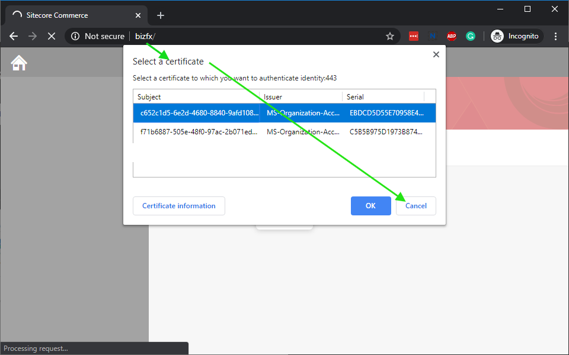

# Tests

## Running XM or XP

To start XM or XP topology based Sitecore instance with a desired set of Sitecore Modules installed (PSE, SXA, JSS or Publishing Service) please use the corresponding docker-compose yml file. For example, to start Sitecore XP with SXA and Publishing Service run the following command in PowerShell:

```{.ps1}
PS> docker-compose -f docker-compose.xp.sxa.ps.yml up
```

## Running XP with Sitecore Horizon (SH)

### Prerequisites and Considerations

- Sitecore Horizon requires DNS names to be configured on your host. The `docker-compose.xp.sh.yml` docker compose file has been defined to add a `monitor` service container that takes care of modifying your hosts file with the required DNS records. The monitor service image has been developed by [Rob Ahnemann](http://rockpapersitecore.com/2020/01/maintain-your-hosts-file-with-a-docker-container/).

- Sitecore Horizon requires the HTTPS protocol in all communications between the `cm` and the `authoringhost` instances and the secure WebSocket protocol between the `authoringhost` instance and the client user browser. You need to create and install a self-signed SSL certificate on your host machine that contains the DNS alternative names of the services names running in the docker compose definition. The following setup steps are based on [Michael West](https://github.com/michaellwest/docker-https)'s solution to run Docker containers with HTTPS:
   - Clone Michael West's repository: https://github.com/michaellwest/docker-https.git
   - Open the folder Startup and with an elevated PowerShell console run the following command: `.\createcert.ps1 -certificatename cert -dnsNameList "*.dev.local"`
   - Copy the 4 generated `cert.*` files in the `startup` folder in this Sitecore Docker Images cloned repository (`\build\windows\tests\9.3.x\startup`).

### Starting XP with Sitecore Horizon instance

After the prerequesites have been executed, to start Sitecore XP with Sitecore Horizon run the following command in PowerShell:

```{.ps1}
PS> docker-compose -f docker-compose.xp.sh.yml up
```

### Device Types Marketing Definition deployment

- Sitecore Horizon installation adds the following three new analytics page dimensions segments that need to be deployed. After starting XP with Sitecore Horizon instance, login in Sitecore (`cm` container), access the Content Editor and deploy the following three marketing definition items using the "Deploy" workflow command:
   - `/sitecore/system/Marketing Control Panel/Experience Analytics/Dimensions/Pages/By page/Computer`
   - `/sitecore/system/Marketing Control Panel/Experience Analytics/Dimensions/Pages/By page/MobilePhone`
   - `/sitecore/system/Marketing Control Panel/Experience Analytics/Dimensions/Pages/By page/Tablet`

## Running XC

### Prerequisites and Considerations

- XC uses the old 9.2 *AND* new 9.3 license mechanism, so set the `LICENSE_PATH` *AND* `SITECORE_LICENSE` environment variables.

- XC requires DNS names to be configured on your host. To do so automatically you can use [whales-names](https://github.com/gregolsky/whales-names). Otherwise, you will need to configure it manually: add `identity` and `bizfx` DNS names your `hosts` file - please note that it needs to reference the internal Container IP, not your local host IP (127.0.0.1).

- Ensure that your local XC instance is not running, specifically BizFx on port 4200 - `bizfx` container will run on the same local port. It is recommended to stop local IIS completely.

### Starting XC Instance

There are a series of different XC images. To start XC instance you can use one of the following commands:

#### XC

```{.ps1}
PS> docker-compose -f docker-compose.xc.yml up
```

#### XC with SPE

```{.ps1}
PS> docker-compose -f docker-compose.xc.spe.yml up
```

#### XC with SPE & SXA

```{.ps1}
PS> docker-compose -f docker-compose.xc.sxa.yml up
```

#### XC with SPE & SXA & SXA Storefront

```{.ps1}
PS> docker-compose -f docker-compose.xc.sxa.storefront.yml up
```

### Initializing Data

Once all containers are running, perform the following Sitecore Commerce post-install steps using Postman:

1. Configure your Postman environment to use:
    - `SitecoreIdServerHost: https://identity`
    - `OpsApiHost: http://localhost:44005`
2. Obtain Identity token
3. [Perform bootstrap](https://doc.sitecore.com/developers/93/sitecore-experience-commerce/en/bootstrap-the-commerce-engine.html)
4. [Initialize environment](https://doc.sitecore.com/developers/93/sitecore-experience-commerce/en/clean-and-initialize-the-environment.html)

> Obtain the Postman collections and environment from the Sitecore Commerce SDK.

To verify that everything is working okay browse to:

1. BizFx (<http://localhost:4200)> and verify that Habitat catalog is present
   - **Important!** If BizFX will prompt you to select a certificate please make sure that you click `Cancel`!
   
2. CM (<http://localhost:44001/sitecore>) and verify that Habitat catalog is present under `/sitecore/Commerce/Catalog Management/Catalogs`

> The Business Tools run at **HTTP** and *not* HTTPS. When browsing to the Business Tools from the Control Panel remove the **S** from the address.

### Storefront Configuration

To setup a storefront, after initializing the engine you need to follow the [standard commerce SXA setup instructions](https://doc.sitecore.com/users/91/sitecore-experience-commerce/en/set-up-a-storefront-site.html):

1. Create a new Tenant.
   - Use a tenant name without spaces and special characters.
1. Create a new Site.
   - Use a site name without spaces and special characters.
   - Use "cd" as the host name for the site.
1. Perform a full publish.
1. Perform an index rebuild of `sitecore_master_index` and `sitecore_web_index`.

After this you can access the storefront on CD (<https://cd/>).
