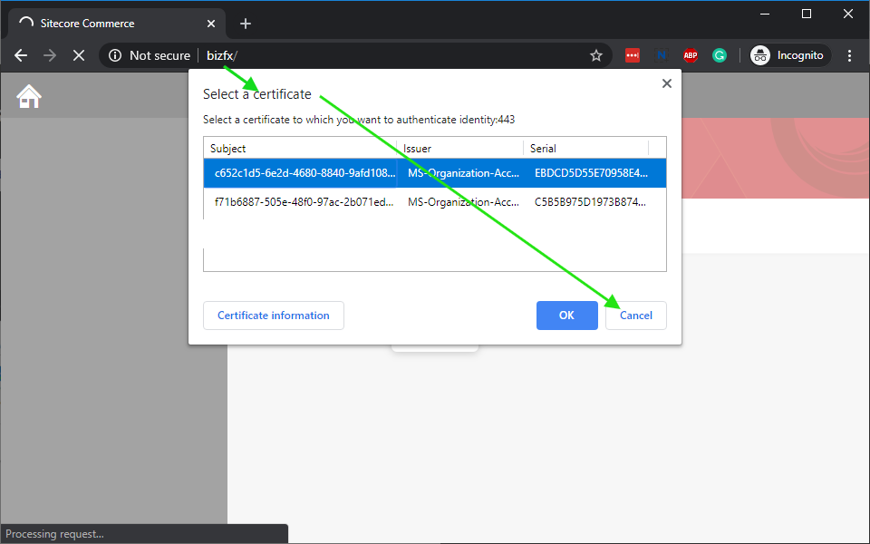

# Tests

## Running XM or XP

To start XM or XP topology based Sitecore instance with a desired set of Sitecore Modules installed (PSE, SXA, JSS or Publishing Service) please use the corresponding docker-compose yml file. For example, to start Sitecore XP with SXA and Publishing Service run the following command in PowerShell:

```{.ps1}
PS> docker-compose -f docker-compose.xp.sxa.ps.yml up
```

## Running XC

### Prerequisites and Considerations

- XC uses the old 9.2 *AND* new 9.3 license mechanism, so set the `LICENSE_PATH` *AND* `SITECORE_LICENSE` environment variables.

- XC requires DNS names to be configured on your host. To do so automatically you can use [whales-names](https://github.com/gregolsky/whales-names). Otherwise, you will need to configure it manually: add `identity` and `bizfx` DNS names your `hosts` file - please note that it needs to reference the internal Container IP, not your local host IP (127.0.0.1).

- Ensure that your local XC instance is not running, specifically BizFx on port 4200 - `bizfx` container will run on the same local port. It is recommended to stop local IIS completely.

### Starting XC Instance

There are a series of different XC images. To start XC instance you can use one of the following commands:

#### XC

```{.ps1}
PS> docker-compose -f docker-compose.xc.yml up
```

#### XC with SPE

```{.ps1}
PS> docker-compose -f docker-compose.xc.spe.yml up
```

#### XC with SPE & SXA

```{.ps1}
PS> docker-compose -f docker-compose.xc.sxa.yml up
```

#### XC with SPE & SXA & SXA Storefront

```{.ps1}
PS> docker-compose -f docker-compose.xc.sxa.storefront.yml up
```

### Initializing Data

Once all containers are running, perform the following Sitecore Commerce post-install steps using Postman:

1. Configure your Postman environment to use:
    - `SitecoreIdServerHost: https://identity`
    - `OpsApiHost: http://localhost:44005`
2. Obtain Identity token
3. [Perform bootstrap](https://doc.sitecore.com/developers/93/sitecore-experience-commerce/en/bootstrap-the-commerce-engine.html)
4. [Initialize environment](https://doc.sitecore.com/developers/93/sitecore-experience-commerce/en/clean-and-initialize-the-environment.html)

> Obtain the Postman collections and environment from the Sitecore Commerce SDK.

To verify that everything is working okay browse to:

1. BizFx (<http://localhost:4200)> and verify that Habitat catalog is present
   - **Important!** If BizFX will prompt you to select a certificate please make sure that you click `Cancel`!
   
2. CM (<http://localhost:44001/sitecore>) and verify that Habitat catalog is present under `/sitecore/Commerce/Catalog Management/Catalogs`

> The Business Tools run at **HTTP** and *not* HTTPS. When browsing to the Business Tools from the Control Panel remove the **S** from the address.

### Storefront Configuration

To setup a storefront, after initializing the engine you need to create a new Tenant & Site, then perform a full publish and index rebuild.

You can follow the [standard setup instructions](https://doc.sitecore.com/users/91/sitecore-experience-commerce/en/set-up-a-storefront-site.html).

After this you can access the storefront on CD (<https://cd/>).
